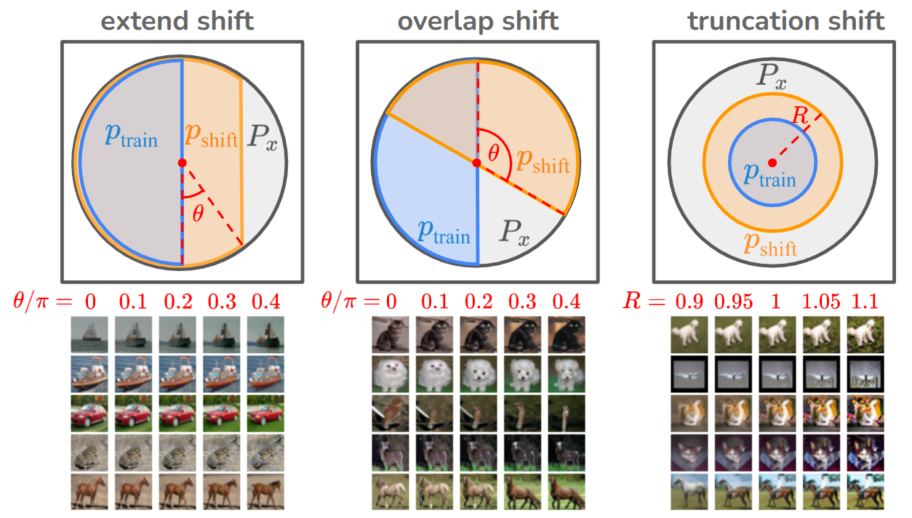
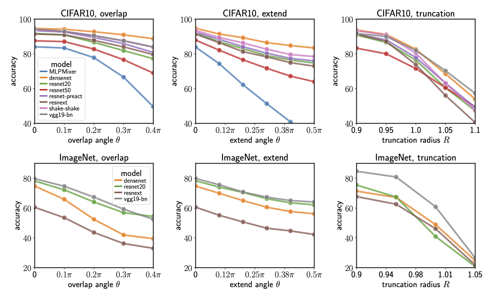

# `Control+Shift`: Generating Controllable Distribution Shifts
[Roy Friedman](https://friedmanroy.github.io/)* and Rhea Chowers*

[](https://arxiv.org/abs/2409.07940) [](https://huggingface.co/datasets/friedmanroy/ctrl-shift)

**Abstract**: _We propose a new method for generating realistic datasets with distribution shifts using any decoder-based generative model. Our approach systematically creates datasets with varying intensities of distribution shifts, facilitating a comprehensive analysis of model performance degradation. We then use these generated datasets to evaluate the performance of various commonly used networks and observe a consistent decline in performance with increasing shift intensity, even when the effect is almost perceptually unnoticeable to the human eye. We see this degradation even when using data augmentations. We also find that enlarging the training dataset beyond a certain point has no effect on the robustness and that stronger inductive biases increase robustness._

--- 

# Accessing Data

To access the `control+shift` data, you can either generate the data from scratch or load our data from [hugging face](https://huggingface.co/datasets/friedmanroy/ctrl-shift).

Our data is based on CIFAR10 and ImageNet, using EDM to generate our data. We generated datasets for 3 types of distribution shift on CIFAR10 and ImageNet - so a total of 6 datasets. The types of distribution shifts are called `overlap`, `extend` and `truncation`. Here's a graphic illustration of how the data was generated:



For each type of distribution shift introduced in our work, multiple shifts are considered. In our experiments, we generated a training dataset only for the base shift (the one with the smallest controlling parameter). For instance, in the `truncation` distribution shift, we considered shifts with controlling parameters in the range `[90, 95, 100, 105, 110]` [^1].  Training data was generated for `trunc=90` and test data was generated for all of them. Training only on one shift amount and testing on all of the others gives a better indication of the degradation in performance of the model under distribution shift.

Here are results we saw for various popular architectures on the datasets we created:



While all the models perform relatively well in the training regime (left most point in each of the graphs), shifting the test distribution degrades performance, even when the images themselves don't look perceptually any different. 
# Generating Data

To use this code, the [requirements of EDM](https://github.com/NVlabs/edm?tab=readme-ov-file#requirements) have to be met. 

The data can be generated by running `generate_dist_shift.py`. The standard usage is:
```bash
python generate_dist_shift.py --dataset cifar10 --exp overlap --value 0 --root path/to/save/directory/
```
The possible experiment types, as described in the paper, are `overlap`, `extend` and `trunc`. For each of these, a training set is generated for only a specific value:
- `overlap` train set is generated when `value=0`; values supported in range `[0,100]`
- `extend` train set is generated when `value=50`; values supported in range `[50,100]`
- `trunc` train set is generated when `value=90`; any value above 0 is supported, but images with high perceptual quality are usually in the range `[90,110]`

When a training distribution is generated, a validation set is also generated. Otherwise, only a test set is generated. The amount of samples to generate can be set by the `n_train`, `n_val` or `n_test` flags. 

As previously mentioned, we use [EDM](https://arxiv.org/abs/2206.00364) to generate all our images. So far, we support only `cifar10` or `imagenet` arguments under the `dataset` flag. For `cifar10`, 32x32x3 images are generated for all 10 classes in CIFAR10, while for `imagenet` 64x64x3 images are generated for (the rather small subset of) 10 classes of ImageNet[^2]. The image quality using EDM depends on the number of steps used during diffusion, which can be modified using the `n_step` flag. The default number of steps is 50 which has high quality for both the CIFAR10 and ImageNet generation tasks, although it can be reduced for faster generation with some price in perceptual quality.


---

[^1]: See Appendix A in the paper for more information on these parameter values.
[^2]: The classes are those indexed by 0,100,...,900 in the original ImageNet dataset to ensure that the classes don't semantically overlap.